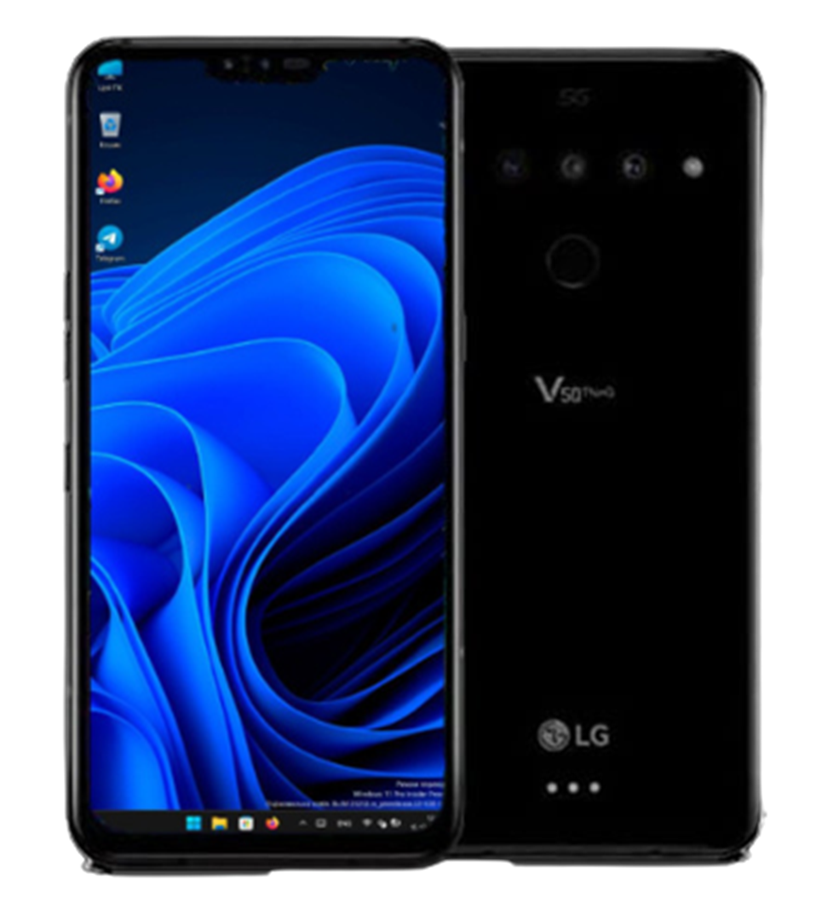

# Running Windows on the LG V50

## Choose your language
**English** | [Español](README-es.md)

## A few notes

> [!NOTE]
> Welcome 🥰! Thanks for being interested in trying out this project. We thought the following notes may interest you first before proceeding further:
>
> ℹ️ We recommend you know what you're getting into here. You need to know a bit about command line interfaces, Windows technical aspects, as this is not for the faint of heart yet! We won't teach you how to port the OS yourself, we've done this for you, but this is not for beginners or common users either. Tech Savvy people only or technical people only please, or you'll regret it or commit mistakes that may take some time to solve with us!
>
> ℹ️ We do not recommend you buy a LG to try this on without fully understanding what you're getting into. We do not commit to future work or potential functionality, buy the device for what it can offer you today, not tomorrow, or you'll regret it. If you already own a LG and want to try it, feel free 🙂 But do not buy this with hopes of it replacing your laptop, buy a laptop instead 🙂 (Even if this is the long term goal for us)

## Get started
- [Project status](English/status.md)

- [Detailed Project Status](English/detailed-status.md)

- [Installation instructions](English/1-partition.md)

- [Troubleshooting](English/troubleshooting.md)

## Miscellaneous
- [Dualboot setup](English/3-dualboot.md)

- [Additional materials](English/materials.md)

- [Update drivers](English/update.md)

- [Reinstall instructions](English/reinstall.md)

- [Uninstall instructions](English/uninstall.md)